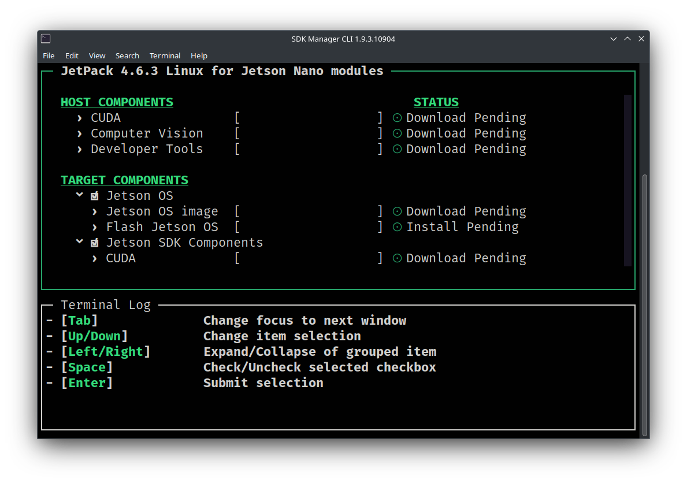
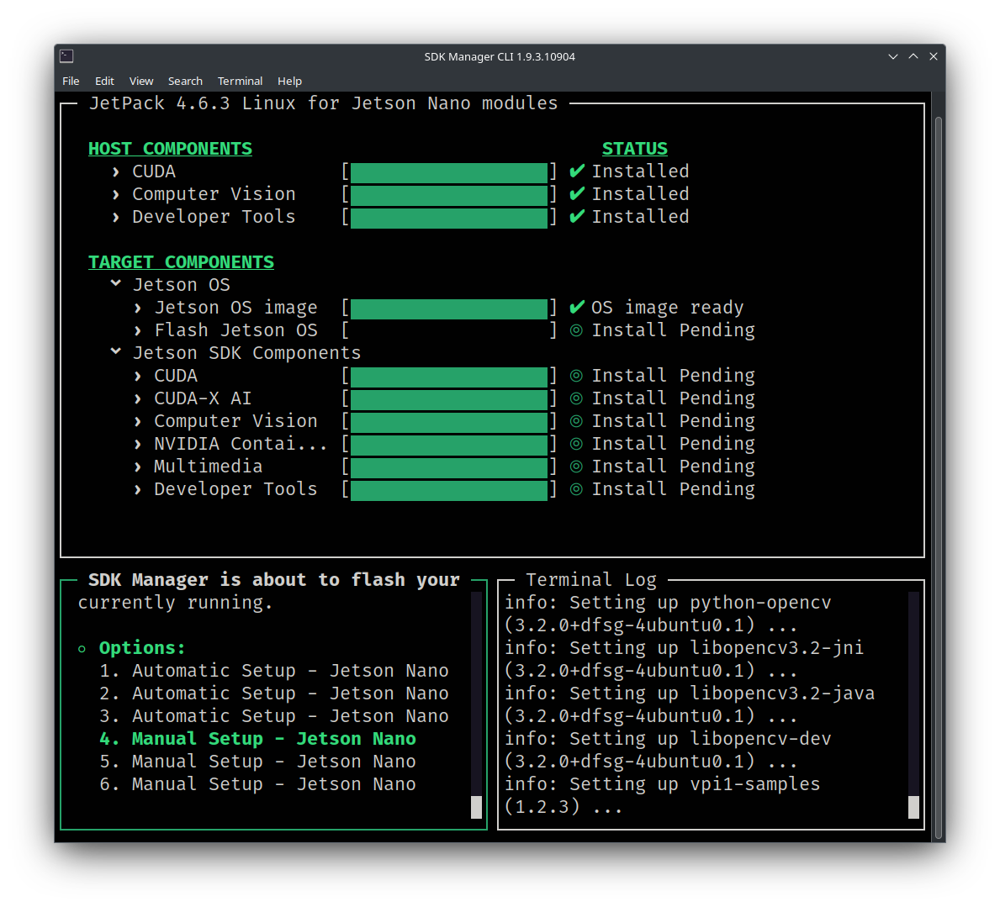

# NVIDIA Jetson Nano Setup

The following instructions are for flashing a 4GB/2GB RAM Jetson Nano regardless of whether your Jetson Nano has an SD card or an embedded EMMC flash chip.

**_NOTE: You may use the SD card flash method found [here](https://developer.nvidia.com/embedded/learn/get-started-jetson-nano-devkit), but it is recommended to use the process below to ensure all of the software is setup correctly._**

**_NOTE: While, in theory, these instructions should work on any computer since Docker is used, Linux was the only operating system used in these instructions._**

## 0. Preliminaries

### Required Software

It is **_HIGHLY_** recommended to use Docker to flash the Jetson Nano to avoid installing Ubuntu 18.04 which will be EOL in 2023. Docker isolates applications and/or operating systems from your host machine without much performance loss.

Install the following software on your computer:

- [Docker](https://docs.docker.com/engine/install/) - Install for Linux, use the `server` installation instructions. Only Docker Engine is needed, Docker Desktop is optional. For example, for installation on Ubuntu use the [Install Docker Engine on Ubuntu](https://docs.docker.com/engine/install/ubuntu/) instructions.

### Required Hardware

- You will need a single Jetson Nano. The following SKUs have been validated and are available on Amazon:

  - [NVIDIA Jetson Nano Developer Kit (945-13450-0000-100)](https://a.co/d/dBzbtOP) - PREFERRED - Includes microSD port.
  - [Yahboom Jetson Nano Developer Kit Nano B01 with 16G-eMMC Based on Official N-VI-Dia Jetson Nano 4GB Core Module](https://a.co/d/9kN3trk) - No microSD port, only embedded EMMC flash. See [Expanding Storage Space on the EMMC Jetson Nano](#a-expanding-storage-space-on-the-emmc-jetson-nano) in the [Appendix](#appendix).

- Optionally, you may wish to purchase some jumper cables, like the ones [here on Amazon](https://a.co/d/bME0vEn), to allow you to easily jump two pins on the Jetson Nano to enter it into "Recovery Mode". If you do not purchase a jumper cable, you will need to use a metal object like a flathead screwdriver.

- A 5V-4A (RECOMMENDED) barrel jack power supply like the one [here on Amazon](https://a.co/d/5xI04st):

- If equipped, a UHS-I 32GB+ microSD card like the one [here on Amazon](https://a.co/d/7e32PQ4).

## 1. Flash the Jetson Nano

### 1.1 Downlaod the Docker Image

**_NOTE: An NVIDIA account is REQUIRED to download the SDK-Manager software below._**

You can download the Docker image for flashing the Jetson Nano directly from NVIDIA here:

https://developer.nvidia.com/sdk-manager

However, if NVIDIA discontinues the 18.04 Docker image you may also download it here:

https://drive.google.com/file/d/1DsTbklTcgBKOPiuPxdXbd7FQCsJLQzFj/view?usp=sharing

### 1.2 Load the Docker Image

Run the following command on your computer with Docker installed replacing `VERSION` with the version of SDK-Manager you downloaded:

```shell
docker load -i ~/Downloads/sdkmanager-VERSION-Ubuntu_18.04_docker.tar.gz
```

Then, tag the image to make using the image easier:

```shell
docker tag sdkmanager:VERSION-Ubuntu_18.04 sdkmanager:18.04
```

### 1.3 Connecting the Jetson

1. Before plugging in your Jetson Nano via USB into your computer, you need to jump two pins on the Jetson Nano to enter it into "Recovery Mode". On our board these pins are labeled `GND` i.e. the ground pin and `FC REC` i.e. the force recovery pin located under the heatsink. You **_MUST_** keep these pins jumped when powering the Jetson Nano on.

2. If applicable, ensure that you have jumped the "DC Barrel Jack" jumper on your Jetson Nano board to allow the Jetson Nano to use the DC power supply.

3. While keeping the `GND` and `FC REC` pins jumped, power on the device by connecting the micro-USB to USB-A port to your computer AND connecting the power supply to the barrel jack on the Jetson Nano.

4. Run the `lsusb` command inside your Linux terminal and you should see output similar to:

```
Bus 001 Device 061: ID 0955:7020 NVIDIA Corp. APX
```

This means that your computer detects the Jetson Nano and it is ready to flash.

5. Connect the Jetson Nano to a monitor.

6. Connect a keyboard and mouse to the Jetson Nano.

### 1.4 Flashing the Jetson Nano using SDK-Manager inside Docker

**_NOTE: An NVIDIA account is REQUIRED to use the SDK-Manager docker image below._**

1. Run the following command inside of your terminal:

```shell
docker run -it --privileged -v /dev/bus/usb:/dev/bus/usb/ -v /dev:/dev -v /media/$USER:/media/nvidia:slave --name JetPack_NX_Devkit --network host sdkmanager:18.04 --cli install --logintype devzone --product Jetson --version 4.6.3 --targetos Linux --host --target JETSON_NANO_TARGETS --flash all --select 'Jetson OS'
```

2. After running the command above you should be prompted to select an authentication method like below. Choose the authentication method by typing 1 or 2 and then follow the corresponding instructions to log into your NVIDIA account.

```
No update is available.
To initiate login process open https://static-login.nvidia.com/service/default/REDACTED in a browser or scan the QR code on your handheld device then login with your NVIDIA Developer account. SDK Manager will start once done.
Login user code: REDACTED. (valid for: 10 minutes).
? SDK Manager is waiting for you to complete login.
  1) Generate a new login user code
  2) Display the QR Code
  3) Cancel login
  Answer:
```

3. After authenticating with your NVIDIA Account, you should see the following screen:


4. Read the Privacy Notice Accept the subsequent license agreements and choose the options you would like. You may choose `No` for the Privacy Notice window and you MUST select `Yes` for the subsequent license agreement.

5. After accepting the license agreements, immediately press the 'spacebar'. This allows you to customize the software that will be downloaded for flashing the Jetson Nano. It is recommended that you keep the default selections (i.e. the `HOST COMPONENTS` and `TARGET COMPONENTS` selected) like below:



6. Press enter to begin downloading the software required for flashing the Jetson Nano device. Depending on your internet connection speed, this usually takes 1-2 hours.

7. While your software is downloading (or after it completes), run the following command inside of a second terminal on your computer to check that the Jetson Nano is detected within the Docker container:

```shell
docker exec -ti JetPack_NX_Devkit lsusb
```

You should see similar output to the following if the Docker container can see the Jetson Nano:

```
Bus 001 Device 061: ID 0955:7020 NVidia Corp.
```

8. Continue waiting for the software to download if it has not finished. Once the software has finished downloading you should see a screen like:



9. Flash the Jetson Nano with `Jetson OS`. Select `4. Manual Setup - Jetson Nano` from the `Options` list on the bottom left corner... FLASH While the OS is flashing you will probably see the monitor the Jetson Nano is connected to flash/reboot several times. This is normal.

10. After the Jetson Nano has been flashed successfully you should see the following image. You will also notice that a setup dialog has appeared on the Jetson Nano's monitor to setup the Jetson Nano's OS. Follow the on-screen instructions to setup the Jetson Nano's OS and DO NOT FORGET the username and password you setup.

11. Install the `Jetson SDK Components`

## 2. Using the Jetson Nano to Run ML Models

COMING SOON

## Appendix

### A. Expanding Storage Space on the EMMC Jetson Nano
