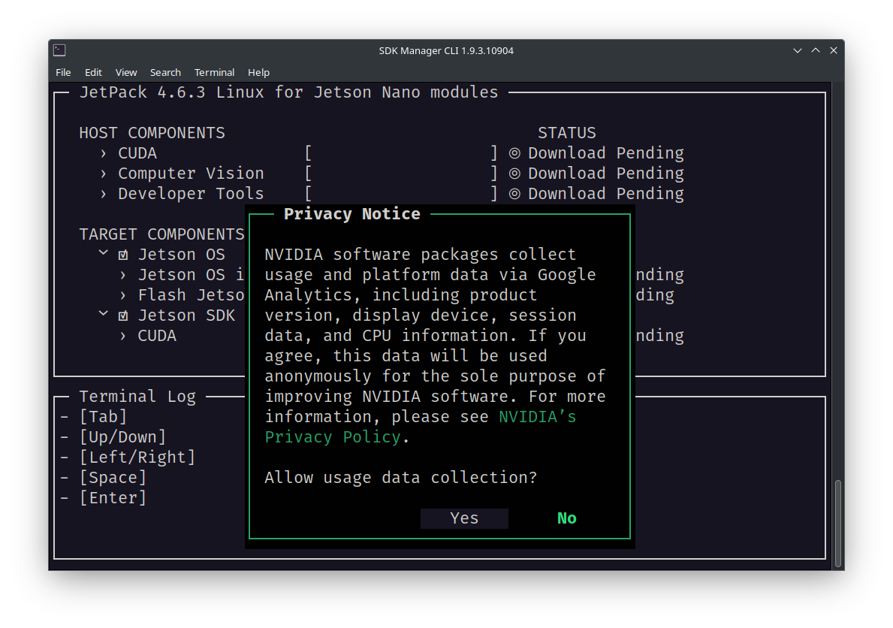
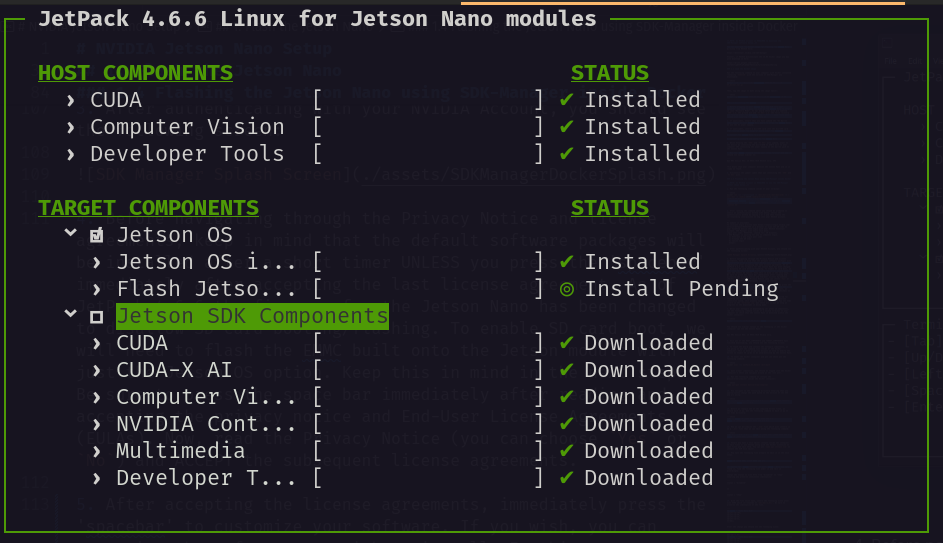
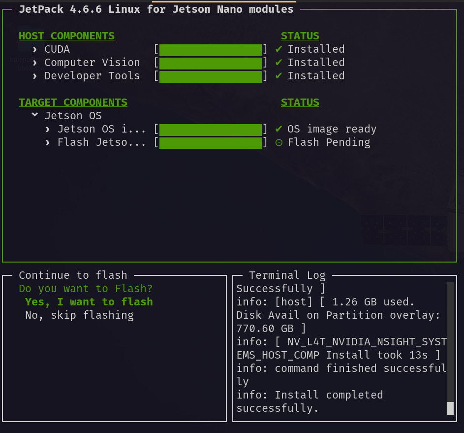

# NVIDIA Jetson Nano Setup

The following instructions are for flashing a 4GB/2GB RAM Jetson Nano regardless of whether your Jetson Nano has an SD card or an embedded EMMC flash chip.

**_NOTE: You may use the SD card flash method found [here](https://developer.nvidia.com/embedded/learn/get-started-jetson-nano-devkit), but it is recommended to use the process below to ensure all of the software is setup correctly._**

**_NOTE: While, in theory, these instructions should work on any computer since Docker is used, Linux was the only operating system used in these instructions._**

## 0. Preliminaries

### Required Software

It is **_HIGHLY_** recommended to use Docker to flash the Jetson Nano to avoid installing Ubuntu 18.04 which will be EOL in 2023. Docker isolates applications and/or operating systems from your host machine without much performance loss.

Install the following software on your computer:

- [Docker](https://docs.docker.com/engine/install/) - Install for Linux, use the `server` installation instructions. Only Docker Engine is needed, Docker Desktop is optional. For example, for installation on Ubuntu use the [Install Docker Engine on Ubuntu](https://docs.docker.com/engine/install/ubuntu/) instructions.

### Required Hardware

- You will need a single Jetson Nano. The following SKUs have been validated and are available on Amazon:

  - [NVIDIA Jetson Nano Developer Kit (945-13450-0000-100)](https://a.co/d/dBzbtOP) - PREFERRED - Includes microSD port.
  - [Yahboom Jetson Nano Developer Kit Nano B01 with 16G-eMMC Based on Official N-VI-Dia Jetson Nano 4GB Core Module](https://a.co/d/9kN3trk) - No microSD port, only embedded EMMC flash. See [Expanding Storage Space on the EMMC Jetson Nano](#a-expanding-storage-space-on-the-emmc-jetson-nano) in the [Appendix](#appendix).

- Optionally, you may wish to purchase some jumper cables, like the ones [here on Amazon](https://a.co/d/bME0vEn), to allow you to easily jump two pins on the Jetson Nano to enter it into "Recovery Mode". If you do not purchase a jumper cable, you will need to use a metal object like a flathead screwdriver.

- A 5V-4A (RECOMMENDED) barrel jack power supply like the one [here on Amazon](https://a.co/d/5xI04st):

- If equipped, a UHS-I 32GB+ microSD card like the one [here on Amazon](https://a.co/d/7e32PQ4).

## 1. Flash the Jetson Nano

### 1.1 Downlaod the Docker Image

**_NOTE: An NVIDIA account is REQUIRED to download the SDK-Manager software below._**

You can download the Docker image for flashing the Jetson Nano directly from NVIDIA here:

https://developer.nvidia.com/sdk-manager

However, if NVIDIA discontinues the 18.04 Docker image you may also download it here:

https://drive.google.com/file/d/1DsTbklTcgBKOPiuPxdXbd7FQCsJLQzFj/view?usp=sharing

### 1.2 Load the Docker Image

Run the following command on your computer with Docker installed replacing `VERSION` with the version of SDK-Manager you downloaded:

```shell
docker load -i ~/Downloads/sdkmanager-VERSION-Ubuntu_18.04_docker.tar.gz
```

Then, tag the image to make using the image easier:

```shell
docker tag sdkmanager:VERSION-Ubuntu_18.04 sdkmanager:18.04
```

### 1.3 Connecting the Jetson

1. Before plugging in your Jetson Nano via USB into your computer, you need to jump two pins on the Jetson Nano to enter it into "Recovery Mode". On our board these pins are labeled `GND` i.e. the ground pin and `FC REC` i.e. the force recovery pin located under the heatsink. You **_MUST_** keep these pins jumped when powering the Jetson Nano on.

2. If applicable, ensure that you have jumped the "DC Barrel Jack" jumper on your Jetson Nano board to allow the Jetson Nano to use the DC power supply.

3. If applicable, insert a microSD card into the microSD card slot located under the daughter board under the headsink.

4. Connect the Jetson Nano to a monitor.

5. Connect a keyboard and mouse to the Jetson Nano.

6. While keeping the `GND` and `FC REC` pins jumped, power on the device by connecting the micro-USB to USB-A port to your computer AND connecting the power supply to the barrel jack on the Jetson Nano.

7. Run the `lsusb` command inside your Linux terminal and you should see output similar to:

```
Bus 001 Device 061: ID 0955:7020 NVIDIA Corp. APX
```

This means that your computer detects the Jetson Nano and it is ready to flash.

8. Disconnect the jumper cable that was connecting the `GND` and `FC REC` pins.

### 1.4 Flashing the Jetson Nano using SDK-Manager inside Docker

**_NOTE: An NVIDIA account is REQUIRED to use the SDK-Manager docker image below._**

1. Run the following command inside of your terminal:

```shell
docker run -it --privileged -v /dev/bus/usb:/dev/bus/usb/ -v /dev:/dev -v /media/$USER:/media/nvidia:slave --name JetPack_NX_Devkit --network host sdkmanager:18.04 --cli install --logintype devzone --product Jetson --version 4.6.3 --targetos Linux --host --target JETSON_NANO_TARGETS --flash all --select 'Jetson OS'
```

2. After running the command above you should be prompted to select an authentication method like below. Choose the authentication method by typing 1 or 2 and then follow the corresponding instructions to log into your NVIDIA account.

```
No update is available.
To initiate login process open https://static-login.nvidia.com/service/default/REDACTED in a browser or scan the QR code on your handheld device then login with your NVIDIA Developer account. SDK Manager will start once done.
Login user code: REDACTED. (valid for: 10 minutes).
? SDK Manager is waiting for you to complete login.
  1) Generate a new login user code
  2) Display the QR Code
  3) Cancel login
  Answer:
```

3. After authenticating with your NVIDIA Account, you should see the following screen:



4. Before navigating through the Privacy Notice and license agreements, keep in mind that the default software packages will be installed after a short timer UNLESS you press the 'spacebar' immediately after accepting the last license agreement. As of JetPack 4.6.6 the firmware for the Jetson Nano has been changed to disallow SD card booting/flashing. To enable SD card boot, we will need to flash the EMMC built onto the Jetson module with just the Jetson OS option. Keep this in mind in the next step. Be sure to press the space bar immediately after reading and accepting the privacy notice and End-User License Agreements (EULAs). Now, read the Privacy Notice (you can choose `Yes` or `No`) and ACCEPT the subsequent license agreements.

5. After accepting the license agreements, immediately press the 'spacebar' to customize your software. If you wish, you can customize the software you wish to install. In this case, we will DESELECT the default TARGET_COMPONENT packages checkbox so that we can install them later after flashing. Your screen should look like the following:



6. Press enter to begin downloading the software required for flashing the Jetson Nano device. Depending on your internet connection speed, this usually takes 1-2 hours. You may see some errors in the `Terminal Log` but these are normal as long as progress on the downloads is being made.

7. While your software is downloading (or after it completes), run the following command inside of a second terminal on your computer to check that the Jetson Nano is detected within the Docker container:

```shell
docker exec -ti JetPack_NX_Devkit lsusb
```

You should see similar output to the following if the Docker container can see the Jetson Nano:

```
Bus 001 Device 061: ID 0955:7020 NVidia Corp.
```

8. Once all of the HOST_COMPONENTS and TARGET_COMPONENTS have finished downloading, you should see the following screen:



9. For now, we are going to just leave this terminal alone and not select either option since we are going to flash the board using the command line.

10. To flash the board and install the software components, we are going to use the command line inside of the Docker container. This is done primarily because we need to modify the kernel to enable SD cards to be used/detected by the Jetson Nano.

11. To enter the Docker container and use its shell use the following command in a new terminal :

```shell
docker exec -ti JetPack_NX_Devkit /bin/bash
```

12. Upon proper completion, you should be logged into the Docker container's shell and navigate around as the root user.

13. Run the following commands to install the device-tree-compiler inside the Docker container:

```shell
sudo apt update
sudo apt-get install device-tree-compiler
```

14. Now navigate to the following directory ensuring that you appropriately change the path based on the version of the SDK you are using:

```shell
cd ~/nvidia/nvidia_sdk/JetPack_4.6.6_Linux_JETSON_NANO_TARGETS/Linux_for_Tegra/kernel/dtb
```

15. Before we replace one of the compiled kernel files, we should back it up. Use the following command to back it up to our home directory:

```shell
sudo cp tegra210-p3448-0002-p3449-0000-b00.dtb ~/tegra210-p3448-0002-p3449-0000-b00.dtb.bak
```

16. Now we can de-compile the `.dtb` file which will convert it to a `.dts` file that we can edit using the following command:

```shell
sudo dtc -I dtb -O dts -o tegra210-p3448-0002-p3449-0000-b00.dts tegra210-p3448-0002-p3449-0000-b00.dtb
```

17. Ensure you have a text editor install inside the container to edit files or use VSCode along with the Docker extension to open files and edit them. You can use `sudo apt install vim` to install the VIM text editor.

18. Now open the following file prepare to edit it in the next steps.

```
tegra210-p3448-0002-p3449-0000-b00.dts
```

19. Search for `sdhci@700b0400` or just `sdhci`. Once you have found it, find the following line under it and edit it accordingly:

Change the status on line 5771 from "disabled" to "okay" ensuring you preserve consistent indentation:

```
status = "disabled"
```

to

```
status = "okay"
```

20. With the file still open, insert the following lines after line 5804 which corresponds to `mmc-ddr-1_8v;`. Be sure to preserve the indentation of the file.

```
cd-gpios = <0x5b 0xc2 0x0>;
sd-uhs-sdr104;
sd-uhs-sdr50;
sd-uhs-sdr25;
sd-uhs-sdr12;
no-mmc;
```

After the change you should see the following lines:

```
...
mmc-ddr-1_8v;
cd-gpios = <0x5b 0xc2 0x0>;
sd-uhs-sdr104;
sd-uhs-sdr50;
sd-uhs-sdr25;
sd-uhs-sdr12;
no-mmc;
uhs-mask = <0x0>;
...
```

21. Now save and close the file.

22. Now that we have re-enabled the SD card, we can re-compile the `.dts` file into the needed `.dtb` file using the following command:

```shell
sudo dtc -I dts -O dtb -o tegra210-p3448-0002-p3449-0000-b00.dtb tegra210-p3448-0002-p3449-0000-b00.dts
```

23. Now we can flash the Jetson Nano. To do this, go up two directories to the following directory:

```shell
cd ~/nvidia/nvidia_sdk/JetPack_4.6_Linux_JETSON_NANO_TARGETS/Linux_for_Tegra/
```

24. Use the following command to flash the Jetson Nano while it is in recovery mode:

```shell
sudo ./flash.sh jetson-nano-emmc mmcblk0p1
```

25. If you get an error about the device not being in recovery mode, see step 1 in Section 1.3.

26. After flashing, the Jetson Nano's screen should appear and should ask you to accept another EULA. Accept it and then following the instructions to create a user, set the hostname, and a password for the Jetson Nano. Be sure to remember this so that we can use it later.

27. Now that the device has been flashed and a user has been setup, we can edit the boot order on the Jetson Nano to point to the SD card. You can either use a mouse and keyboard connected to the Jetson Nano to do this or you can use SSH.

28. To SSH into the Jetson Nano use the following command with the username you setup on the Jetson along with the default IP address below:

```shell
ssh username@192.168.55.1
```

29. Now that you have access to the Jetson, plug the microSD card into the Jetson. We will now need to format the card.

30. Use the following command to confirm that the SD card is detected as `/dev/mmcblk1`:

```shell
sudo fdisk -l
```

31. Confirm that the `/dev/mmcblk1` device shows the expected capacity of the microSD card you inserted.

32. Now run the following command to wipe the filesystem of the SD card:

```shell
sudo wipefs -a /dev/mmcblk1
```

33. Now use fdisk to create the partitions on the SD card. Use the following command:

```shell
sudo fdisk /dev/mmcblk1
```

Now we will need to press the following keys in order while pressing enter after each key:

```
g # Use GPT for disk
n # Press enter until the partition has been created.
w # Write.
```

34. Now you should see the `/dev/mmcblk1p1` partition has been created.

35. Now we need to format the partition so that we can use it. Use the following command:

```shell
sudo mkfs.ext4 /dev/mmcblk1p1
```

36. Once the formatting is complete can now mount the device. Use the following command:

```shell
sudo mount /dev/mmcblk1p1 /mnt
```

37. Now that we have formatted the SD card we need to change the boot order (i.e where the root filesystem to be booted is).

38. To change where the root filesystem is located open `/boot/extlinux/extlinux.conf` file and change where the root file system is located.

Change `root=/dev/mmcblk0p1` to `root=/dev/mmcblk1p1`. You should see the following after this change:

```
APPEND ${cbootargs} quiet root=/dev/mmcblk1p1
```

39. Now we need to copy the root filesystem from the EMMC to the SD card. Use the following command to do so ensuring there is a space between / and /mnt:

```shell
sudo cp -ax / /mnt
```

40. Once the copy has finished shutdown the Jetson using the following command:

```shell
sudo shutdown -h now
```

41. Ensure that the jumper wire for entering recover is REMOVED and turn the Jetson back on. You may see a lot of log messages when booting up the Jetson but this is fine.

42. Once you see that the Jetson is back on at the login screen, SSH into the Jetson and ensure that you have booted to the SD card. You can see this by running the following command:

```shell
sudo df -h
```

43. If the SD card was booted, then you should see that the root filesystem i.e. `/dev/mmcblk1p1` is mounted on `/` like below:

```
Filesystem      Size  Used Avail Use% Mounted on
/dev/mmcblk1p1   59G   14G   42G  25% /
```

44. Now we can install the Jetson TARGET_COMPONENTS software. To do this open the SDK Manager UI again and choose `No, skip flashing` when asked if you wish to flash.


45. Afterwards, the SDK manager will ask you for the login credentials for the Jetson Nano to install the TARGET_COMPONENTS via SSH. Ensure that you choose the USB install option via IPv4. After selecting USB and IPv4, enter the username and password you setup for the Jetson Nano and the software will be installed over SSH to the Jetson Nano.

46. Once the software TARGET_COMPONENTS have been installed exit the SDK Manager container by pressing `CRTL + C` and choosing to exit.

47. Reboot the Jetson Nano using `sudo reboot`.

#### Restarting/Saving the Docker Container

48. In the future, if you need to re-flash your Jetson Nano you can simply run the following command and re-flash your Jetson Nano with the same process, except you will not have to wait for the software to download again. Be sure if you do need to re-flash your Jetson Nano that you enter the Jetson Nano into recovery mode again.

```shell
docker start -ai JetPack_NX_Devkit
```

49. You can also save your docker container named `JetPack_NX_Devkit` as an image and a `.tar` file by running the following two commands:

```shell
docker commit JetPack_NX_Devkit jetpack_nx_devkit:flashed
docker export jetpack_nx_devkit:flashed -o jetpack_nx_devkit.tar
```

## 2. Using the Jetson Nano to Run ML Models

TODO: Add more here.

1. Use `trtexec` or a Python script to convert an `.onnx` model to TensorRT format i.e. `.trt`.

2. Run the model using PyCUDA.

## References

Instruction to use SD cards with Jetson OS 4.6.6 were found:
https://wiki.youyeetoo.com/en/JETSON_NANO/Firmwareupdate

## Appendix

### A. Post-Install Script (OPTIONAL)

For deployment settings, you can OPTIONALLY use the [postinstall.sh](./postinstall.sh) script to turn off serveral services, update the OS, disable the GUI, install several dependencies, setup conda, setup ssh, and more.

### B. Installing a Light-Weight GUI (OPTIONAL)

There are many display managers (DMs) and desktop environments (DEs) available for Linux. Display managers simply display the GUI. Desktop environments are the GUI interface you use in Linux. Both are required to install and use a GUI. We will use light-weight options for the Jetson Nano since it is resource constrained: LightDM for the DM and XFCE4 for the DE.

To install LightDM and XFCE4 for your Jetson Nano, run the following commands:

1. `sudo apt update` # Updates APT package repos
2. `sudo apt upgrade` # Upgrades all of the software
3. `sudo apt install lightdm` # Install and Configure LightDM as default if asked.
4. `sudo dpkg-reconfigure lightdm` # Select lightdm
5. `sudo apt install xfce4 xfce4-goodies` # Install XFCE4 GUI
6. `sudo systemctl set-default multi-user.target` # re-enables the GUI if you used the postinstall.sh script.
7. Reboot your machine and the GUI should show up asking for login credentials. Be sure to look for a button to select `XFCE Session` to select XFCE as your DE.

### C. Using External Drives

There are two ways to use an external drive on the Jetson Nano: 1) move the home directory (_i.e._ /home) to the external drive or 2) use the external drives as the default OS to boot.

#### C.1 Moving the Home Directory to an External Drive

**_\*\*\*NOTE: The `movehome.sh` script is meant to document the commands to run to move the home directory to another drive. It is NOT meant to be run as a script._**

See the instructions in the [movehome.sh](./movehome.sh) script for details on how to move the `/home` directory from being on the SD/EMMC drive to the external drive attached via USB.

We based the [movehome.sh](./movehome.sh) script off of the instructions provided at: https://www.howtogeek.com/442101/how-to-move-your-linux-home-directory-to-another-hard-drive/

#### C.2 Change the Default Boot Drive

To change the boot drive you must configure the kernel boot parameters for Linux to point to another drive. To do this, you must first install an OS on the SD/EMMC drive of the Jetson Nano, boot into the OS on the SD/EMMC drive, copy the filesystem, and then change the boot parameters.

These instructions were inspired by jetsonhacks/bootFromUSB, but they are _NOT_ 1-to-1.
Credit: https://github.com/jetsonhacks/bootFromUSB

**WARNING: This may cause the device to slow down. For higher performance simply change the home directories of users to default to the USB storage device.**

1. Connect USB/SSD to Jetson Nano.
2. Erase and format your USB storage device to a GPT and EXT4 naming the Partition/Label 'APP'.
3. Run `sudo fdisk -l` and find the partition of the EXT4 files-system on the USB storage device (assuming /dev/sda1 herein).
4. `sudo mount /dev/sda1 /mnt`
5. `sudo rsync -axHAWX --numeric-ids --info=progress2 --exclude=/proc / "/mnt"`
6. `sudo blkid -o value -s PARTUUID /dev/sda1`
7. `sudo cp /boot/extlinux/extlinux.conf ~/extlinux.conf.bak`
8. Edit the extlinux.conf file using `sudo vi /boot/extlinux/extlinux.conf` located on the EMMC storage.
9. Copy the 'primary' entry and paste it directly below the first 'primary' entry (i.e. duplicate the entry).
10. Change the _second_ entry you just copied to be named 'sdcard'.
11. Modify the _first_ entry and change `root=/dev/mmcblk0p1` to `root=PARTUUID=32a76e0a-9aa7-4744-9954-dfe6f353c6a7` replacing the long string with _YOUR_ PARTUUID returned by step 6. Note the PARTUUID should be similar to `32a76e0a-9aa7-4744-9954-dfe6f353c6a7` in length.
