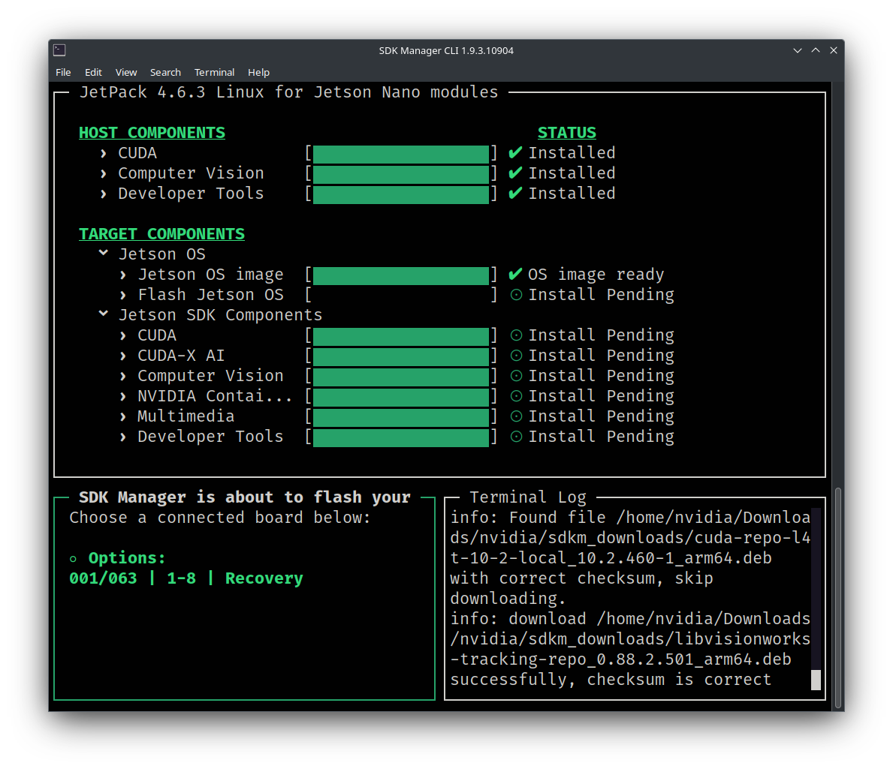
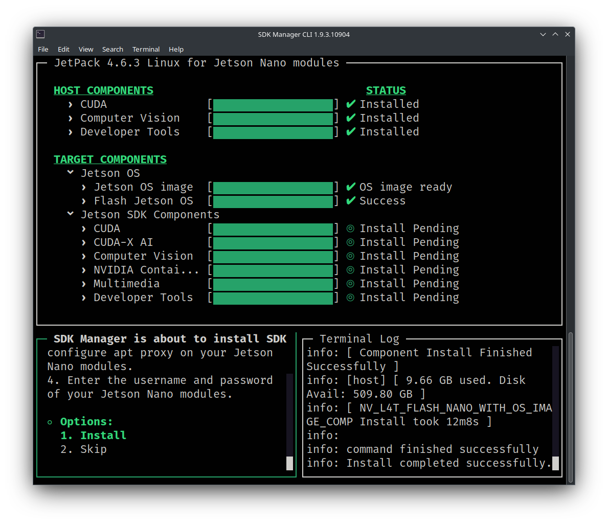
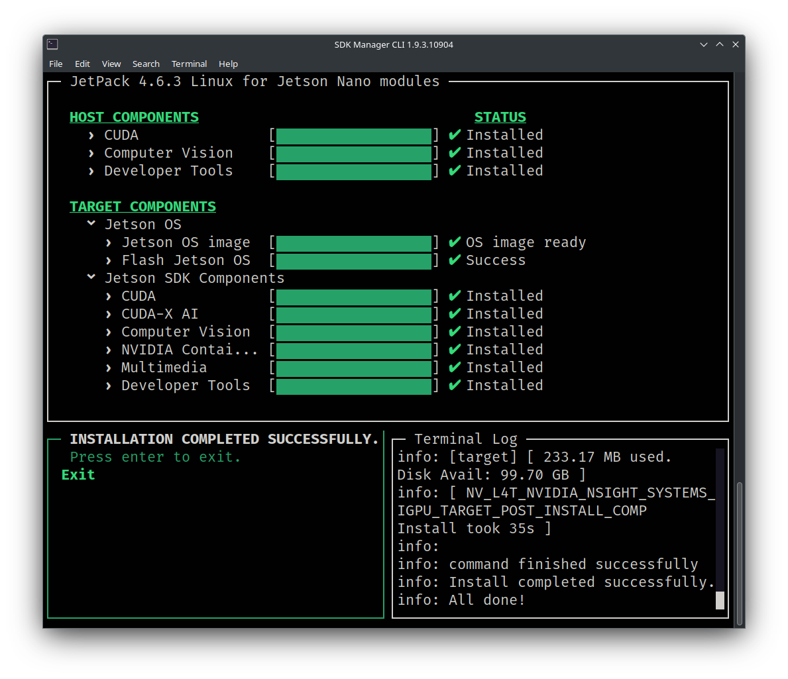

# NVIDIA Jetson Nano Setup

The following instructions are for flashing a 4GB/2GB RAM Jetson Nano regardless of whether your Jetson Nano has an SD card or an embedded EMMC flash chip.

**_NOTE: You may use the SD card flash method found [here](https://developer.nvidia.com/embedded/learn/get-started-jetson-nano-devkit), but it is recommended to use the process below to ensure all of the software is setup correctly._**

**_NOTE: While, in theory, these instructions should work on any computer since Docker is used, Linux was the only operating system used in these instructions._**

## 0. Preliminaries

### Required Software

It is **_HIGHLY_** recommended to use Docker to flash the Jetson Nano to avoid installing Ubuntu 18.04 which will be EOL in 2023. Docker isolates applications and/or operating systems from your host machine without much performance loss.

Install the following software on your computer:

- [Docker](https://docs.docker.com/engine/install/) - Install for Linux, use the `server` installation instructions. Only Docker Engine is needed, Docker Desktop is optional. For example, for installation on Ubuntu use the [Install Docker Engine on Ubuntu](https://docs.docker.com/engine/install/ubuntu/) instructions.

### Required Hardware

- You will need a single Jetson Nano. The following SKUs have been validated and are available on Amazon:

  - [NVIDIA Jetson Nano Developer Kit (945-13450-0000-100)](https://a.co/d/dBzbtOP) - PREFERRED - Includes microSD port.
  - [Yahboom Jetson Nano Developer Kit Nano B01 with 16G-eMMC Based on Official N-VI-Dia Jetson Nano 4GB Core Module](https://a.co/d/9kN3trk) - No microSD port, only embedded EMMC flash. See [Expanding Storage Space on the EMMC Jetson Nano](#a-expanding-storage-space-on-the-emmc-jetson-nano) in the [Appendix](#appendix).

- Optionally, you may wish to purchase some jumper cables, like the ones [here on Amazon](https://a.co/d/bME0vEn), to allow you to easily jump two pins on the Jetson Nano to enter it into "Recovery Mode". If you do not purchase a jumper cable, you will need to use a metal object like a flathead screwdriver.

- A 5V-4A (RECOMMENDED) barrel jack power supply like the one [here on Amazon](https://a.co/d/5xI04st):

- If equipped, a UHS-I 32GB+ microSD card like the one [here on Amazon](https://a.co/d/7e32PQ4).

## 1. Flash the Jetson Nano

### 1.1 Downlaod the Docker Image

**_NOTE: An NVIDIA account is REQUIRED to download the SDK-Manager software below._**

You can download the Docker image for flashing the Jetson Nano directly from NVIDIA here:

https://developer.nvidia.com/sdk-manager

However, if NVIDIA discontinues the 18.04 Docker image you may also download it here:

https://drive.google.com/file/d/1DsTbklTcgBKOPiuPxdXbd7FQCsJLQzFj/view?usp=sharing

### 1.2 Load the Docker Image

Run the following command on your computer with Docker installed replacing `VERSION` with the version of SDK-Manager you downloaded:

```shell
docker load -i ~/Downloads/sdkmanager-VERSION-Ubuntu_18.04_docker.tar.gz
```

Then, tag the image to make using the image easier:

```shell
docker tag sdkmanager:VERSION-Ubuntu_18.04 sdkmanager:18.04
```

### 1.3 Connecting the Jetson

1. Before plugging in your Jetson Nano via USB into your computer, you need to jump two pins on the Jetson Nano to enter it into "Recovery Mode". On our board these pins are labeled `GND` i.e. the ground pin and `FC REC` i.e. the force recovery pin located under the heatsink. You **_MUST_** keep these pins jumped when powering the Jetson Nano on.

2. If applicable, ensure that you have jumped the "DC Barrel Jack" jumper on your Jetson Nano board to allow the Jetson Nano to use the DC power supply.

3. If applicable, insert a microSD card into the microSD card slot located under the daughter board under the headsink.

4. Connect the Jetson Nano to a monitor.

5. Connect a keyboard and mouse to the Jetson Nano.

6. While keeping the `GND` and `FC REC` pins jumped, power on the device by connecting the micro-USB to USB-A port to your computer AND connecting the power supply to the barrel jack on the Jetson Nano.

7. Run the `lsusb` command inside your Linux terminal and you should see output similar to:

```
Bus 001 Device 061: ID 0955:7020 NVIDIA Corp. APX
```

This means that your computer detects the Jetson Nano and it is ready to flash.

8. Disconnect the jumper cable that was connecting the `GND` and `FC REC` pins.

### 1.4 Flashing the Jetson Nano using SDK-Manager inside Docker

**_NOTE: An NVIDIA account is REQUIRED to use the SDK-Manager docker image below._**

1. Run the following command inside of your terminal:

```shell
docker run -it --privileged -v /dev/bus/usb:/dev/bus/usb/ -v /dev:/dev -v /media/$USER:/media/nvidia:slave --name JetPack_NX_Devkit --network host sdkmanager:18.04 --cli install --logintype devzone --product Jetson --version 4.6.3 --targetos Linux --host --target JETSON_NANO_TARGETS --flash all --select 'Jetson OS'
```

2. After running the command above you should be prompted to select an authentication method like below. Choose the authentication method by typing 1 or 2 and then follow the corresponding instructions to log into your NVIDIA account.

```
No update is available.
To initiate login process open https://static-login.nvidia.com/service/default/REDACTED in a browser or scan the QR code on your handheld device then login with your NVIDIA Developer account. SDK Manager will start once done.
Login user code: REDACTED. (valid for: 10 minutes).
? SDK Manager is waiting for you to complete login.
  1) Generate a new login user code
  2) Display the QR Code
  3) Cancel login
  Answer:
```

3. After authenticating with your NVIDIA Account, you should see the following screen:


4. Before navigating through the Privacy Notice and license agreements, keep in mind that the default software packages will be installed after a short timer UNLESS you press the 'spacebar' immediately after accepting the last license agreement. We recommend keeping the default selections so pressing any key is completely OPTIONAL. It is alright to allow the defaults to auto-install after the short timer expires or by pressing 'enter'. Now, read the Privacy Notice (you can choose `Yes` or `No`) and ACCEPT the subsequent license agreements.

5. After accepting the license agreements, you have a few seconds to press the 'spacebar' if you would like to customize your software. This is OPTIONAL. This allows you to customize the software that will be downloaded for flashing the Jetson Nano. It is recommended that you keep the default selections (i.e. the `HOST COMPONENTS` and `TARGET COMPONENTS` selected) like below:


6. Press enter to begin downloading the software required for flashing the Jetson Nano device. Depending on your internet connection speed, this usually takes 1-2 hours. You may see some errors in the `Terminal Log` but these are normal as long as progress on the downloads is being made.

7. While your software is downloading (or after it completes), run the following command inside of a second terminal on your computer to check that the Jetson Nano is detected within the Docker container:

```shell
docker exec -ti JetPack_NX_Devkit lsusb
```

You should see similar output to the following if the Docker container can see the Jetson Nano:

```
Bus 001 Device 061: ID 0955:7020 NVidia Corp.
```

8. Continue waiting for the software to download if it has not finished. Once the software has finished downloading you should see a screen like:



9. Click the `SDK Manager is about...` area and press enter to select `Options: XYZ/ABC | 1-8 | Recovery` to select your Jetson Nano in recovery mode. Flash the Jetson Nano with `Jetson OS` by selecting `4. Manual Setup - Jetson Nano` from the `Options` list on the bottom left corner.

10. Ensure Jetson Nano is powered via the barrel jack power supply AND connected to the PC via the USB cable. Press enter to continue when asked to `Continue?`.

11. Select `Runtime` from the `OEM Configuration` list.

12. While the OS is flashing you will probably see the monitor the Jetson Nano is connected to flash/reboot several times. This is normal. The full flashing process takes around ~20 minutes.

13. After the Jetson Nano has been flashed successfully you should see the following image.



14. You will also notice that a `System Configuration` dialog has appeared on the Jetson Nano's monitor to setup the Jetson Nano's OS. Keep the Jetson Nano attached to your host computer running the Docker container and then follow the on-screen instructions to setup the Jetson Nano's OS and DO NOT FORGET the username and password you setup.

15. After setting up the Jetson Nano's OS, it will appear to reboot and land on a login screen. From here, you can proceed with installing the `Jetson SDK Components`. Like the previous picture of the screen `SDK Manager is about to install SDK...` select `1. Install` and press enter.

16. When prompted to `Connect via` select `USB cable` and press enter.

17. When prompted to `Choose a connected board below:` select the Jetson Nano in recovery mode and press enter.

18. When prompted to `Enter SSH connect details to Jetson Nano modules:` select `IPv4` as the `IP type` and press enter.

19. Leave the `IP address` as the default address of `192.168.55.1`.

20. Enter the `Username` for the user you setup on the Jetson Nano and press enter.

21. Enter the `Password` for the user you setup on the Jetson Nano and press enter.

22. If you entered the credentials correctly, the Jetson SDK components should begin installing. This process can take ~1 hour. Note that you may see a couple of errors in the `Terminal Log`, but as long as the installation continues, this is normal.

23. If all of the SDK Components were installed correctly you should see the following screen:



24. You have now successfully flashed your Jetson Nano. To exit the Docker container simply press the `CTRL` and `c` key on your keboard at the same time and confirm you wish to exit. You should see the following after you exit:

```
  ===== INSTALLATION COMPLETED SUCCESSFULLY. =====
      - CUDA on Host: Up-to-date
      - CUDA Cross Compile Package on Host: Up-to-date
      - VisionWorks on Host: Up-to-date
      - VPI on Host: Up-to-date
      - Nsight Graphics: Up-to-date
      - Nsight Systems: Up-to-date
      - Drivers for Jetson: Up-to-date
      - File System and OS: Up-to-date
      - Flash Jetson Nano: Installed
      - DateTime Target Setup: Installed
      - CUDA Toolkit for L4T: Installed
      - cuDNN on Target: Installed
      - TensorRT on Target: Installed
      - OpenCV on Target: Installed
      - VisionWorks on Target: Installed
      - VPI on Target: Installed
      - NVIDIA Container Runtime with Docker integration (Beta): Installed
      - Multimedia API: Installed
      - Nsight Systems CLI: Installed

  ===== Installation completed successfully - Total 19 components =====
  ===== 11 succeeded, 0 failed, 8 up-to-date, 0 skipped =====
```

25. Now login into the Jetson Nano and reboot the device and you should be ready to use it.

26. In the future, if you need to reflash your Jetson Nano you can simply run the following command and re-flash your Jetson Nano with the same process, except you will not have to wait for the software to download again. Be sure if you do need to reflash your Jetson Nano that you enter the Jetson Nano into recovery mode again.

```shell
docker start -ai JetPack_NX_Devkit
```

27. You can also save your docker container named `JetPack_NX_Devkit` as an image and a `.tar` file by running the following two commands:

```shell
docker commit JetPack_NX_Devkit jetpack_nx_devkit:flashed
docker export jetpack_nx_devkit:flashed -o jetpack_nx_devkit.tar
```

## 2. Using the Jetson Nano to Run ML Models

COMING SOON

## Appendix

### A. Post-Install Script (OPTIONAL)

For deployment settings, you can OPTIONALLY use the [postinstall.sh](./postinstall.sh) script to turn off serveral services, update the OS, disable the GUI, install several dependencies, setup conda, setup ssh, and more.

### B. Installing a Light-Weight GUI (OPTIONAL)

There are many display managers (DMs) and desktop environments (DEs) available for Linux. Display managers simply display the GUI. Desktop environments are the GUI interface you use in Linux. Both are required to install and use a GUI. We will use light-weight options for the Jetson Nano since it is resource constrained: LightDM for the DM and XFCE4 for the DE.

To install LightDM and XFCE4 for your Jetson Nano, run the following commands:

1. `sudo apt update` # Updates APT package repos
2. `sudo apt upgrade` # Upgrades all of the software
3. `sudo apt install lightdm` # Install and Configure LightDM as default if asked.
4. `sudo dpkg-reconfigure lightdm` # Select lightdm
5. `sudo apt install xfce4 xfce4-goodies` # Install XFCE4 GUI
6. `sudo systemctl set-default multi-user.target` # re-enables the GUI if you used the postinstall.sh script.
7. Reboot your machine and the GUI should show up asking for login credentials. Be sure to look for a button to select `XFCE Session` to select XFCE as your DE.
