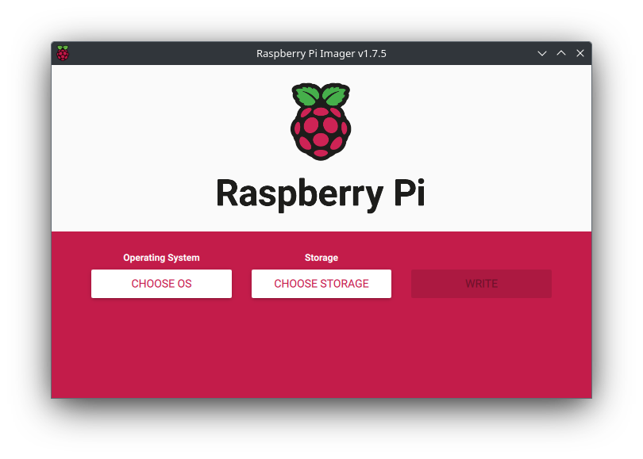
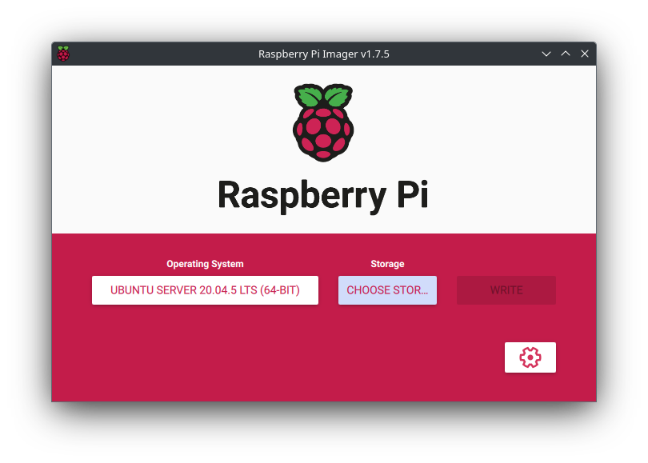

# Raspberry Pi 4 Model B

By default the Raspberry Pi only contains an ARM based CPU, memory (RAM), and connection interfaces like GPIO, USB, etc.

## 0. Preliminaries

### Required Software

- [Raspberry Pi Imager](https://www.raspberrypi.com/software/)
  - Download for your computer's OS.

### Required Hardware

- [Raspberry Pi 4 Model B 8 GB](https://www.raspberrypi.com/products/raspberry-pi-4-model-b/?variant=raspberry-pi-4-model-b-8gb)
  - [CanaKit Raspberry Pi 4 Extreme Kit - Aluminum Edition (8GB RAM)
    ](https://a.co/d/26mRvJY) - We recommend this kit to get started easier with all the necessary cables, power supplies, etc. However, you can buy the Raspberry Pi alone if you wish.

Keep in mind if you choose not to buy a kit including a microSD card, you will need to purchase one similar to [this on on Amazon](https://a.co/d/7e32PQ4) for the OS.

## 1. Flashing microSD Card with OS

1. Insert the microSD card into your computer with Raspberry Pi Imager installed. You may need to format the microSD card to allow it to be seen by Raspberry Pi Imager. You can format it to exFAT on any OS and it will be seen by the imager.

2. Open Raspberry Pi Imager. The following window should appear:



3. Click `CHOOSE OS`. You can choose one of the following operating systems. Note that some of these do not have graphical user interfaces (GUIs). Since the Raspberry Pi is resource constrained it is recommended to use the Pi without a GUI if possible. However if you require a GUI, we recommend installing a light-weight one like LightDM + XFCE4 (see [Installing a GUI](#installing-a-gui) for details).

- `Raspberry Pi OS (other)` > `Rasberry Pi OS (64-bit)`
- `Raspberry Pi OS (other)` > `Rasberry Pi OS Lite (64-bit)`
  - **_Note: No GUI included! See [Installing a GUI](#installing-a-gui)!_**
- ` Other general-purpose OS` > `Ubuntu` > `Ubuntu Server 20.04.5 LTS (64-bit)`
  - **_RECOMMENDED, Note: No GUI included! See [Installing a GUI](#installing-a-gui)!_**

Now your window should look like:



4. Now, click `CHOOSE STORAGE` and select the microSD card you selected.

**_WARNING: Ensure you selected the correct device! The next step will permanently ERASE the device you selected!_**

5. Click `WRITE` and wait for the microSD card to be flashed.

## 2. Booting to the microSD card

1. While the Raspberry Pi is powered off, insert the microSD card into the Raspberry Pi's microSD card slot.

2. Connect a mouse and keyboard to the Raspberry Pi's USB port(s).

3. Connect the Raspberry Pi to a monitor.

4. Connect an ethernet cable to the Raspberry Pi for internet (if available). **_Note: You may need to contact your IT admin to get wired network access._**

5. Power on the Raspberry Pi.

6. Depending on the OS you installed you will need to either setup your login credentials or use the default configured credentials.

For Ubuntu Server installs the default credentials are:

- Username: `ubuntu`
- Password: `ubuntu`

For Raspberry Pi OS:

- Username: `pi`
- Password: `raspberry`

If these don't work, then you can simply search for `default raspberry pi login` and you should get a list of options to try.

6. Change the default user's password (if not automatically prompted).

```shell
passwd default_username # change the password for a username
```

7. Lock the root account to disable login with root:

```shell
sudo passwd root --lock
```

8. Create a new user with sudo access:

```shell
sudo useradd -m new_username
sudo usermod -aG sudo new_username
```

9. Logout of the default user using the `exit` command and then login with the new user you created and change the default shell to bash:

```shell
chsh -s /bin/bash
```

10. Delete the default user and its home directory:

```shell
sudo userdel /home/default_username
sudo rm -rf /home/default_username
```

11. Connect the Raspberry Pi to the internet using an ethernet cable if you haven't already and update the system with:

```shell
sudo apt update
sudo apt upgrade -y
sudo apt autoremove --purge
```

12. Reboot the Raspberry Pi using `sudo reboot`.

## 3. Running Machine Learning Applications

To run ML applications on the Raspberry Pi you have two choices:

- Run the ML application on the CPU
- Run the ML model on a connected edge accelerator

Refer to the specific edge accelerator's documentation for details on setup info for the Raspberry Pi.

**_NOTE: Setup may be different for the Raspberry Pi since it has an ARM based CPU!_**

### Running ML Applications on the Raspberry Pi CPU

COMING SOON

## Apendix

### Installing a GUI

For Ubuntu Server/Raspberry Pi OS Lite - OPTIONAL

There are many display managers (DMs) and desktop environments (DEs) available for Linux. Display managers simply display the GUI. Desktop environments are the GUI interface you use in Linux. Both are required to install and use a GUI. We will use light-weight options for the Raspberry Pi since it is resource constrained: LightDM for the DM and XFCE4 for the DE.

To install LightDM and XFCE4 for your Raspberry Pi, run the following commands:

1. `sudo apt update` # Updates APT package repos
2. `sudo apt upgrade` # Upgrades all of the software
3. `sudo apt install lightdm` # Install and Configure LightDM as default if asked.
4. `sudo dpkg-reconfigure lightdm` # Select lightdm
5. `sudo apt install xfce4 xfce4-goodies` # Install XFCE4 GUI
6. Reboot your machine and the GUI should show up asking for login credentials. Be sure to look for a button to select `XFCE Session` to select XFCE as your DE.

### Setting Up a Simple Firewall

**_NOTE: Installing a firewall is recommended to prevent unauthorized parties from accessing the Pi as well as lock down ports for incoming traffic. However, keep in mind this will affect services like SSH._**

1. Install the Uncomplicated FireWall (UFW) via apt:

```shell
sudo apt install ufw
```

2. Enable the ufw service at startup and start the service.

```shell
sudo systemctl enable ufw
sudo systemctl start ufw
sudo ufw enable
sudo ufw default deny
```

3. Allow any services, like SSH, through the firewall. For example:

```shell
sudo ufw allow 22 # 22 is the default port for SSH
# OR
sudo ufw allow ssh # This is an alternative way of allowing SSH
```
